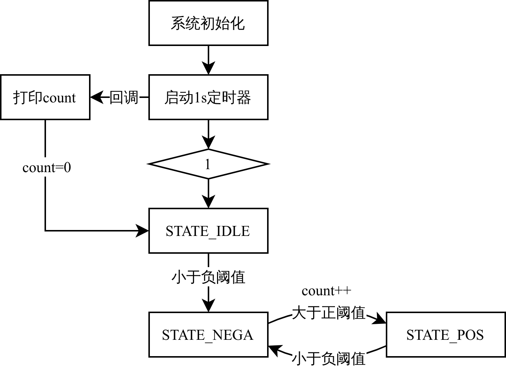

# PIC-IOT WA Finger Count Recognition

基于 Microchip 的 EV54Y39A PIC-IOT WA 开发板，通过板卡上集成的光照传感器，将板卡平放后，每秒对挥动的手指数量进行检测。在较强光源下，可准确识别挥动的手指数量。

# 📦 Prerequisites

开发环境：MPLAB X IDE v6.20

1. 编译器：[xc16 v2.10](https://www.microchip.com/en-us/tools-resources/develop/mplab-xc-compilers/xc16)，这个版本的编译器确保编译通过
2. Packs: PIC24F-GA-GB_DFP 1.9.336、PKOB nano 1.13.715
3. MCC Content Libraries：
   1. MCC core 5.7.1
   2. PIC24 / dsPIC33 MCUs 1.171.4
   3. Board Support Library 1.12.0

# 📜 Documentation

## ⛓️ Workflow

    

## 📽️ More details

1. 项目详细说明，[CSDN：基于EV54Y39A PIC-IOT-WA的手指数量检测功能开发(MPLAB+ADC)](https://blog.csdn.net/weixin_46422143/article/details/139219335)
2. 项目功能演示，[B站：基于EV54Y39A PIC-IOT-WA的手指数量检测功能开发](https://www.bilibili.com/video/BV12f421d7YR/)
